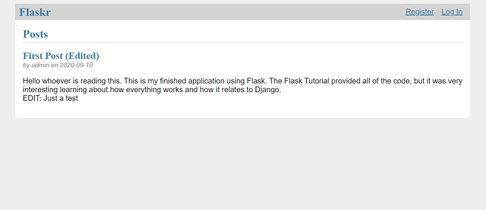
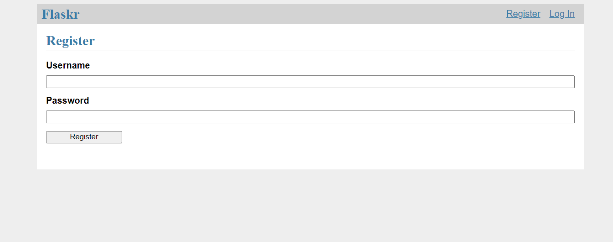
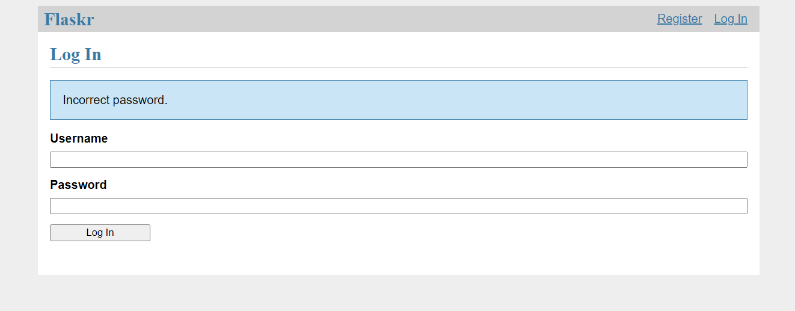
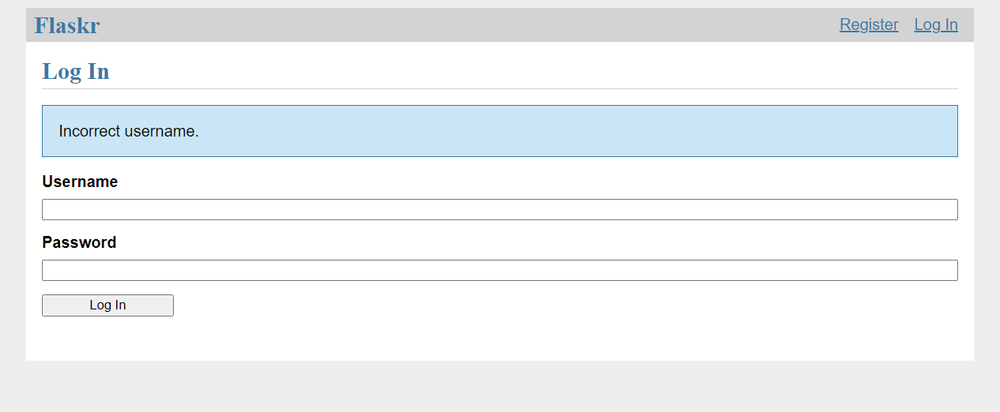
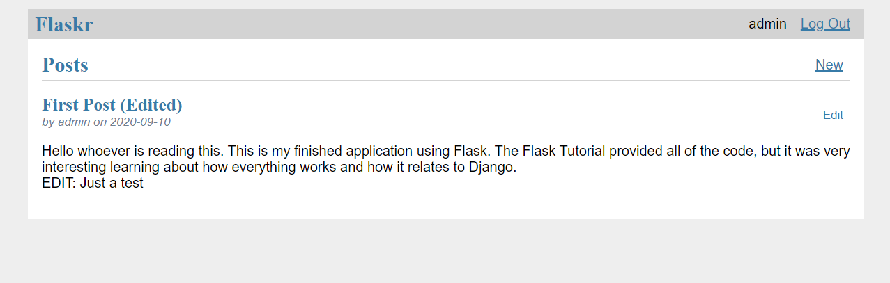
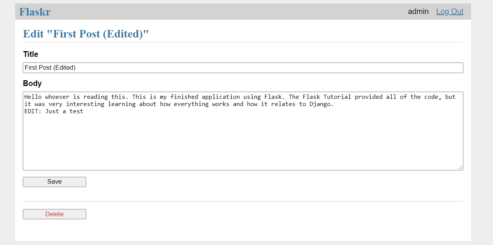
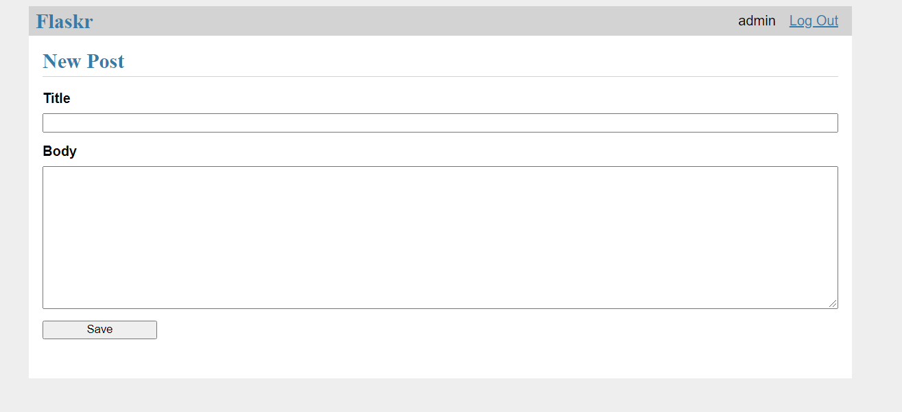

# Flask-Tutorial

Flaskr- A blog site made using Flask and following the Flask Tutorial

## How To Use

**Must have Python 3 installed in order to use**

1. After cloning the repository, change to the root directory of the repository using a shell using `cd Flask-Tutorial`.
2. Then, create a virtual environment (or don't do it if you do not want to) and run the command `pip install -r requirements.txt` to get the required dependencies. If you would like to install the app to run it from outside the repository directory, run the command `pip install -e .`.
3. On Windows in cmd, run the command `set FLASK_APP=flaskr`. Or if on Linux in Terminal, run `export FLASK_APP=flaskr`.
4. Activate the virtual environment if you made one, then run the command `flask run` to start the webserver.
5. Visit `http://127.0.0.1:5000/` with your web browser to access the site (username is "admin", password is "admin").

## Images

## Future Improvements

I plan to add some features for further practice.
- [ ] A detail view to show a single post. Click a post’s title to go to its page.
- [ ] Like / unlike a post.
- [ ] Comments.
- [ ] Tags. Clicking a tag shows all the posts with that tag.
- [ ] A search box that filters the index page by name.
- [ ] Paged display. Only show 5 posts per page.
- [ ] Upload an image to go along with a post.
- [ ] Format posts using Markdown.
- [ ] An RSS feed of new posts.
